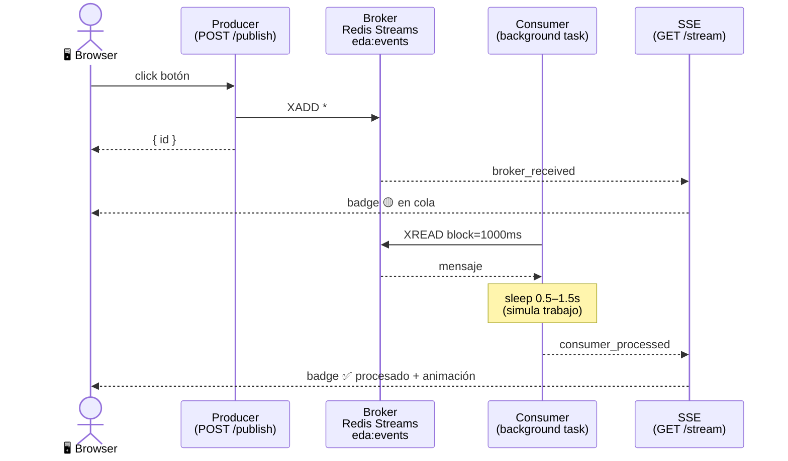

# 🔄 EDA Lab — Event Driven Architecture Demo

Una aplicación demostrativa que muestra en **tiempo real** cómo fluye un evento desde un Producer, pasa por un Broker (Redis Streams), y llega a un Consumer — todo visible en el browser sin recargar la página.

---

## 🖼️ Vista general



---

## 🚀 Quickstart

**1. Genera el lockfile** (solo la primera vez):

```bash
cd app
uv lock
cd ..
```

**2. Levanta los servicios:**

```bash
docker compose up --build
```

**3. Abre el browser:**

```
http://localhost:8000
```

---

## 📁 Estructura del proyecto

```
eda-lab/
├── docker-compose.yml      # Redis + App
└── app/
    ├── Dockerfile           # python:3.12-slim + uv
    ├── pyproject.toml       # dependencias del proyecto
    ├── uv.lock              # lockfile reproducible
    ├── main.py              # FastAPI: producer, consumer, SSE
    └── templates/
        └── index.html       # UI de tres columnas (sin frameworks)
```

---

## 🧩 Arquitectura

### Producer
Endpoint `POST /publish` que hace `XADD` al stream `eda:events` en Redis. Acepta tres tipos de eventos:

| Tipo | Descripción | Payload |
|---|---|---|
| `deploy` | 🚀 Deploy exitoso | `app`, `version`, `env` |
| `cpu_alert` | 🔴 CPU crítico | `server`, `cpu`, `threshold` |
| `error_500` | ❌ Error HTTP 500 | `service`, `endpoint`, `code` |

### Broker — Redis Streams
El stream `eda:events` actúa como cola durable. Los eventos persisten en Redis aunque la app se reinicie — el consumer los retoma en orden al volver.

### Consumer
Background task (`asyncio`) que arranca con la app vía `lifespan`. Lee el stream con `XREAD` bloqueante (block=1000ms) y simula procesamiento con un sleep aleatorio de 0.5 a 1.5 segundos.

### SSE — Server-Sent Events
El endpoint `GET /stream` mantiene una conexión abierta con el browser y emite dos eventos:

- `broker_received` → el evento entró al stream (badge amarillo 🟡)
- `consumer_processed` → el consumer terminó (badge verde ✅ + animación)

---

## 🛠️ Stack

| Componente | Tecnología |
|---|---|
| Backend | [FastAPI](https://fastapi.tiangolo.com/) + [uvicorn](https://www.uvicorn.org/) |
| Broker | [Redis Streams](https://redis.io/docs/data-types/streams/) |
| Cliente Redis | `redis.asyncio` |
| Frontend | HTML + CSS + JS vanilla (sin frameworks) |
| Package manager | [uv](https://docs.astral.sh/uv/) |
| Contenedores | Docker Compose |

---

## 🧪 Probar la persistencia

Puedes verificar que Redis actúa como cola durable:

```bash
# 1. Publica algunos eventos desde el browser

# 2. Para la app (no Redis)
docker compose stop app

# 3. Reinicia — el consumer procesa los eventos pendientes en orden
docker compose start app
```

---

## 📋 Logs

```bash
docker compose logs -f app
```

Ejemplo de salida:

```
12:34:01 [INFO] PRODUCER  → published  type=deploy     id=1710851641234-0
12:34:01 [INFO] BROKER    → received   type=deploy     id=1710851641234-0
12:34:01 [INFO] CONSUMER  → processing type=deploy     id=1710851641234-0 (0.87s)
12:34:02 [INFO] CONSUMER  → processed  type=deploy     id=1710851641234-0
```
