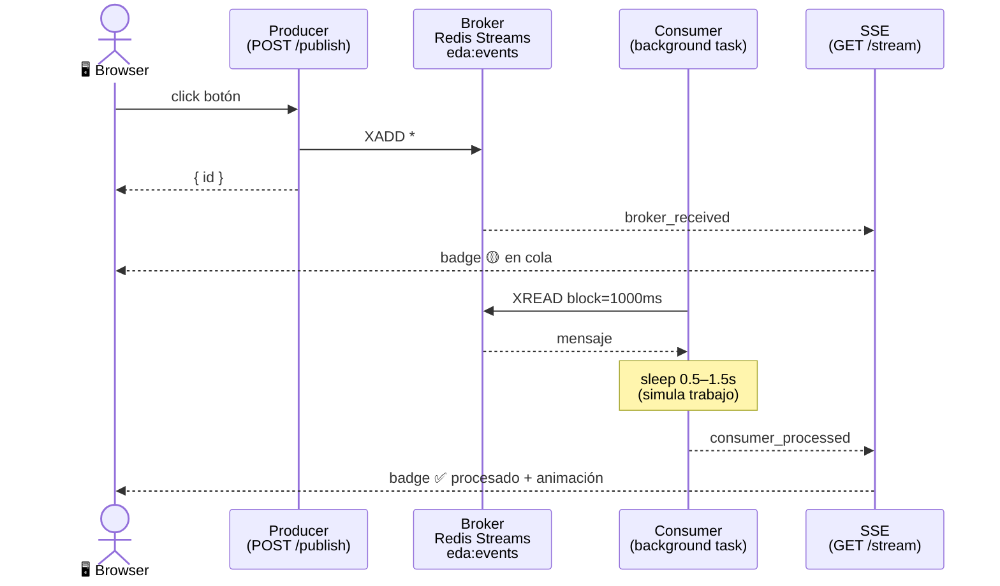

# 🔄 EDA Lab — Event Driven Architecture Demo

Una aplicación demostrativa que muestra en **tiempo real** cómo fluye un evento desde un Producer, pasa por un Broker (Redis Streams), y llega a un Consumer — todo visible en el browser sin recargar la página.

---

## 🖼️ Vista general



### ¿Cómo leer el diagrama?

El diagrama muestra el viaje completo de un evento desde que haces click hasta que aparece procesado en el browser. De izquierda a derecha hay 5 participantes:

**1. Browser → Producer** `click botón`
Cuando haces click en uno de los botones, el browser hace un `POST /publish` al backend.

**2. Producer → Broker** `XADD *`
El backend escribe el evento en Redis Streams. El `*` significa "Redis, asígnale un ID automático".

**3. Producer → Browser** `{ id }`
Redis devuelve el ID generado y el backend se lo retorna al browser. En este momento el evento ya está en la cola.

**4. Broker → SSE** `broker_received`
El consumer background task lee el evento del stream y lo manda por el canal SSE.

**5. SSE → Browser** `badge 🟡 en cola`
El browser recibe el evento SSE y pinta el badge amarillo en la columna del Broker — el evento llegó pero aún no fue procesado.

**6. Consumer → Broker** `XREAD block=1000ms`
El consumer está constantemente preguntándole a Redis "¿hay mensajes nuevos?" — el `block=1000ms` significa que espera hasta 1 segundo antes de preguntar de nuevo.

**7. Broker → Consumer** `mensaje`
Redis le entrega el evento al consumer.

**8. Consumer** `sleep 0.5–1.5s`
El consumer simula trabajo real con un sleep aleatorio. En una app real aquí iría la lógica de negocio.

**9. Consumer → SSE** `consumer_processed`
Terminado el procesamiento, el consumer notifica al canal SSE.

**10. SSE → Browser** `badge ✅ procesado + animación`
El browser actualiza el badge a verde en la columna Broker y hace aparecer el evento en la columna Consumer con la animación.

> 💡 La clave del diagrama es que el **Producer y el Consumer son independientes** — el Producer no espera a que el Consumer termine. Redis Streams actúa como buffer entre los dos, lo que es la esencia de una arquitectura event-driven.

---

## 🚀 Quickstart

**1. Levanta los servicios:**

```bash
docker compose up --build
```

**2. Abre el browser:**

```
http://localhost:8000
```

---

## 📁 Estructura del proyecto

```
eda-lab/
├── docker-compose.yml      # Redis + App
└── app/
    ├── Dockerfile           # python:3.14-alpine + uv
    ├── pyproject.toml       # dependencias del proyecto
    ├── main.py              # FastAPI: producer, consumer, SSE
    └── templates/
        └── index.html       # UI de tres columnas (sin frameworks)
```

---

## 🧩 Arquitectura

### Producer
Endpoint `POST /publish` que hace `XADD` al stream `eda:events` en Redis. Acepta tres tipos de eventos:

| Tipo | Descripción | Payload |
|---|---|---|
| `deploy` | 🚀 Deploy exitoso | `app`, `version`, `env` |
| `cpu_alert` | 🔴 CPU crítico | `server`, `cpu`, `threshold` |
| `error_500` | ❌ Error HTTP 500 | `service`, `endpoint`, `code` |

### Broker — Redis Streams
El stream `eda:events` actúa como cola durable. Los eventos persisten en Redis aunque la app se reinicie — el consumer los retoma en orden al volver.

### Consumer
Background task (`asyncio`) que arranca con la app vía `lifespan`. Lee el stream con `XREAD` bloqueante (block=1000ms) y simula procesamiento con un sleep aleatorio de 0.5 a 1.5 segundos.

### SSE — Server-Sent Events
El endpoint `GET /stream` mantiene una conexión abierta con el browser y emite dos eventos:

- `broker_received` → el evento entró al stream (badge amarillo 🟡)
- `consumer_processed` → el consumer terminó (badge verde ✅ + animación)

---

## 🛠️ Stack

| Componente | Tecnología |
|---|---|
| Backend | [FastAPI](https://fastapi.tiangolo.com/) + [uvicorn](https://www.uvicorn.org/) |
| Broker | [Redis Streams](https://redis.io/docs/data-types/streams/) |
| Cliente Redis | `redis.asyncio` |
| Frontend | HTML + CSS + JS vanilla (sin frameworks) |
| Package manager | [uv](https://docs.astral.sh/uv/) |
| Contenedores | Docker Compose |

---

## 🧪 Probar la persistencia

Puedes verificar que Redis actúa como cola durable:

```bash
# 1. Publica algunos eventos desde el browser

# 2. Para la app (no Redis)
docker compose stop app

# 3. Reinicia — el consumer procesa los eventos pendientes en orden
docker compose start app
```

---

## 📋 Logs

```bash
docker compose logs -f app
```

Ejemplo de salida con colores ANSI:

```
10:23:55 PRODUCER  → publishing type=error_500  payload={...}
10:23:55 PRODUCER  → published  type=error_500  id=1773977035955-0
10:23:55 BROKER    → received   type=error_500  id=1773977035955-0
10:23:55 CONSUMER  → processing type=error_500  id=1773977035955-0 (1.05s)
10:23:57 CONSUMER  → processed  type=error_500  id=1773977035955-0
```
